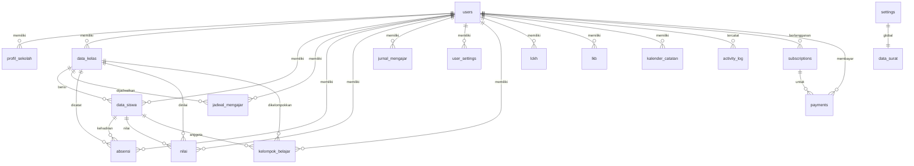

# Audit Aplikasi — 17 Agustus 2026

> **Aplikasi:** Jurnal Guru — Dashboard Guru (administrasi kelas, absensi, nilai, jurnal, LCKH/LKB)
> **Commit yang diaudit:** `ba6e63d`
> **Status:** Selesai
> **Sumber:** source code aktual (folder `src/`). Informasi yang tidak ditemukan ditulis "Tidak ditemukan dalam source code."

# Executive Summary

Jurnal Guru adalah aplikasi web full-stack (Next.js App Router) untuk administrasi guru: data siswa/kelas, absensi, rekap presensi, jurnal mengajar, nilai, rekap nilai, kelompok belajar, kalender, template surat, serta laporan pegawai (LCKH dan LKB). Aplikasi memakai model freemium: Gratis (trial 2 hari, 1 kelas), Pro (Rp 29.000/6 bulan), Premium (Rp 49.000/6 bulan). Pembayaran via transfer bank (BRI) dengan verifikasi manual oleh admin.

Arsitektur: monorepo tunggal `src/` — frontend (React 19 + Tailwind v4), backend (Route Handlers Next.js), database SQLite (adaptor ganda: D1 Cloudflare atau Turso/libsql lokal). Auth JWT (jose) berbasis cookie `session` (httpOnly, 30 hari) + verifikasi email via Resend. Aplikasi sudah memiliki: dashboard dengan statistik & grafik, manajemen pengguna & pembayaran untuk admin, activity log, backup data, export Excel/PDF, integrasi Google Sheets, notifikasi sosial proof, banner upgrade, dan preview fitur terkunci.

Basis yang kuat untuk dikembangkan menjadi **Marketing Management Platform**: auth + RBAC (Admin/User) yang sudah matang, pola API terstruktur (`apiOk`/`apiError`), lapisan DB dengan ownership scoping, komponen UI reusable, sistem pembayaran & paket, activity log, serta pola halaman dokumentasi internal (Marketing Plan) yang bisa diperluas.

# Technology Stack

| Layer | Teknologi | Keterangan |
|---|---|---|
| Framework | Next.js `16.3.1` | App Router, React Server Components + Route Handlers |
| Bahasa | TypeScript 5 | strict di seluruh `src/` |
| Frontend | React `19.2.8` + react-dom | Client components untuk interaksi, server components untuk halaman |
| Backend | Next.js Route Handlers | `src/app/api/**/route.ts` |
| Database | SQLite | Adaptor ganda: **D1 Cloudflare** (via `getCloudflareContext`) → fallback **Turso/libsql** (`DATABASE_URL` + `TURSO_AUTH_TOKEN`) → fallback file lokal `file:./data.db` (`src/db/index.ts`) |
| ORM | Drizzle ORM `0.45.2` (+ drizzle-kit) | Schema di `src/db/schema.ts` |
| Authentication | `jose` (JWT HS256) + `bcryptjs` | Cookie `session`, expiry 30 hari |
| State management | Tanpa library | `useState`/`useEffect` lokal per halaman; hook `useUserPlan` untuk plan |
| UI framework | Tailwind CSS v4 | Utility classes + CSS custom di `globals.css` |
| Chart | Chart.js `4.5.1` | Bar chart dashboard (canvas) |
| Export Excel | `xlsx-js-style` | Export absensi/nilai ke `.xlsx` |
| Export PDF | Print browser (`window.print()` + CSS print) | Halaman cetak presensi & dokumen |
| ID | `uuid` v4 | id kolom berbasis UUID |
| Email | Resend (via `RESEND_API_KEY`) | Verifikasi email aktivasi, berlaku 24 jam |
| Google Sheets | Service Account (JWT RS256 manual, `node:crypto`) | Sinkronisasi data ke spreadsheet |
| Build/Deploy | Vercel (GitHub integration, push `main`) | CNAME `guru.cintabuku.site`; legacy Cloudflare worker `opennextjs-cloudflare` untuk domain lama |
| Tooling | npm; `next build`, `eslint`, `drizzle-kit push/generate` | Playwright terpasang sebagai dependency; penggunaannya tidak ditemukan dalam source code |

**Script (`package.json`):** `build`, `dev`, `start`, `lint`, `seed`, `db:generate`, `db:migrate` (drizzle-kit push), `cf:build`, `preview`, `deploy`, `upload` (opennextjs-cloudflare, legacy), `cf-typegen`.

# Application Structure

```
src/
├── app/
│   ├── layout.tsx              # Root layout (font, metadata)
│   ├── globals.css             # Tailwind v4 + komponen custom (.card, .table-wrap, .badge, dark mode, print, animasi)
│   ├── page.tsx                # Landing page (publik)
│   ├── error.tsx / not-found.tsx
│   ├── login/ register/        # Auth pages (+layout.tsx khusus)
│   ├── checkout/               # Pilih paket (checkout/page.tsx) + konfirmasi (checkout/konfirmasi/page.tsx)
│   ├── (app)/                  # Grup route ber-auth (layout bersama: Sidebar + UpgradeBanner + SocialProofToast)
│   │   ├── layout.tsx / loading.tsx
│   │   ├── dashboard/ admin/ billing/ users/ marketing-plan/ documentation/
│   │   ├── siswa/ kelas/ jadwal/ absensi/ rekap-absensi/ jurnal/
│   │   ├── nilai/ rekap-nilai/ kelompok/
│   │   ├── lckh/ lkb/
│   │   ├── profil/ settings/ kalender/ surat/ faq/ panduan/ subscription/ log/
│   └── api/                    # Route Handlers (lihat Route Map & API Documentation)
├── components/                 # Komponen UI reusable (lihat Reusable Components)
├── db/
│   ├── index.ts                # Koneksi DB (D1 → Turso → file lokal)
│   └── schema.ts               # 16 tabel Drizzle
└── lib/
    ├── auth.ts                 # JWT, session, requireAuth/requireAdmin, scoping, bcrypt, addLog
    ├── plans.ts                # Paket, limit kelas, trial, requirePlan
    ├── plan-helpers.ts         # normalizePlan, PLAN_RANK, isAdminRole, deriveRoleLabel
    ├── useUserPlan.ts          # Hook client untuk plan user
    ├── useApi.ts               # apiGet/apiPost/apiPut/apiDelete + redirect 401
    ├── utils.ts                # formatDate, apiOk/apiError, todayISO, esc, hariList, kategoriNilai
    ├── ownership.ts            # canUseKelas / canUseSiswa (cek kepemilikan data)
    ├── dokumen.ts              # getProfil + render template dokumen (untuk LCKH/LKB/surat)
    ├── email.ts                # Resend: kirim email verifikasi, token, expiry
    ├── sheets.ts               # Google Sheets: JWT service account, auth token, write
    ├── rateLimit.ts            # Rate limiting in-memory (10 percobaan/10 menit per IP+path)
    ├── owner.ts / seed.ts      # Utilitas seeding data dummy
    └── db-helpers.ts           # Helper query (getByUserId, getById, dll)
```
# Route Map

## Halaman Publik (tanpa login)

| Path | Fungsi | File |
|---|---|---|
| `/` | Landing page: hero, masalah, fitur, cara kerja, harga, testimoni, CTA, footer | `src/app/page.tsx` |
| `/login` | Login (mendukung `?returnUrl=`, `?verify=`/`?activated=`) | `src/app/login/page.tsx` |
| `/register` | Registrasi (wajib verifikasi email) | `src/app/register/page.tsx` |
| `/checkout` | Pilih paket Pro/Premium (publik untuk melihat harga; pembuatan payment butuh auth) | `src/app/checkout/page.tsx` |
| `/checkout/konfirmasi` | Konfirmasi pembayaran (input bukti transfer) | `src/app/checkout/konfirmasi/page.tsx` |

## Halaman Authenticated User (grup `(app)`)

| Path | Fungsi | Akses |
|---|---|---|
| `/dashboard` | Dashboard: statistik, grafik distribusi siswa, ringkasan data | Semua user login |
| `/siswa` | CRUD data siswa (+ upload massal Excel) | User (scoped) & Admin |
| `/kelas` | CRUD data kelas (batas 1 kelas untuk Gratis) | User (scoped) & Admin |
| `/jadwal` | CRUD jadwal mengajar | User (scoped) & Admin |
| `/absensi` | Catat absensi harian per kelas, cetak presensi | User (scoped) & Admin |
| `/rekap-absensi` | Rekap persentase kehadiran per siswa + export Excel | User (scoped) & Admin |
| `/jurnal` | CRUD jurnal mengajar | User (scoped) & Admin |
| `/nilai` | Input nilai + KKM per siswa | **min. Pro** (`PlanGuard`) |
| `/rekap-nilai` | Rekap nilai + grafik | **min. Pro** (`PlanGuard`) |
| `/kelompok` | Generate & kelola kelompok belajar | **min. Pro** (`PlanGuard`) |
| `/lckh` | Generate & kelola LCKH (dari jurnal mengajar) | **Premium** (`PlanGuard`) |
| `/lkb` | Generate & kelola LKB | **Premium** (`PlanGuard`) |
| `/kalender` | Catatan kalender pribadi | Semua user login |
| `/profil` | Profil pengguna + profil sekolah + foto | Semua user login |
| `/settings` | Pengaturan user (tahun ajaran, semester, KKM, dark mode) + pengaturan aplikasi (admin) | Semua user login; global keys admin |
| `/surat` | Template surat (CRUD) | Semua user login (tidak ter-scope ke user) |
| `/faq` | Pertanyaan umum | Semua user login |
| `/panduan` | Panduan penggunaan | Semua user login |
| `/subscription` | Status langganan + riwayat | Semua user login |
| `/marketing-plan` | Rencana pemasaran (baca dari `.agents/marketing-plan-jurnal-guru.md`) | **Admin only** (`AdminGuard`) |

## Halaman Admin only

| Path | Fungsi | File |
|---|---|---|
| `/admin` | Dashboard admin: statistik user/payment, verifikasi pembayaran, kelola user, activity log | `src/app/(app)/admin/page.tsx` |
| `/billing` | Tagihan: rekening penerima, verifikasi pembayaran, riwayat | `src/app/(app)/billing/page.tsx` |
| `/users` | Kelola user (tambah/edit/hapus, reset plan) | `src/app/(app)/users/page.tsx` |
| `/log` | Activity log aplikasi | `src/app/(app)/log/page.tsx` |

## API Endpoints

| Path | Metode | Fungsi | Auth |
|---|---|---|---|
| `/api/auth/login` | POST | Login (username/email + password), set cookie session | Publik (rate limited) |
| `/api/auth/register` | POST | Registrasi user baru + kirim email verifikasi | Publik (rate limited) |
| `/api/auth/logout` | POST | Hapus cookie session | Auth |
| `/api/auth/check` | GET | Cek sesi: return user (id, username, role, nama, plan, planExpires) | Publik (membaca cookie) |
| `/api/auth/verify-email` | GET | Verifikasi token email, aktifkan akun | Publik |
| `/api/auth/resend-verification` | POST | Kirim ulang email verifikasi | Publik (rate limited) |
| `/api/me` | GET/PUT | Baca/ubah profil user (nama, foto, email) | Auth |
| `/api/me/password` | PUT | Ganti password | Auth |
| `/api/dashboard` | GET | Data dashboard (jumlah siswa/kelas/absensi/nilai, grafik per kelas) | Auth |
| `/api/siswa` | GET/POST | List/tambah siswa | Auth (scoped) |
| `/api/siswa/[id]` | GET/PUT/DELETE | Detail/ubah/hapus siswa | Auth (scoped) |
| `/api/kelas` | GET/POST | List/tambah kelas (limit plan) | Auth (scoped) |
| `/api/kelas/[id]` | GET/PUT/DELETE | Detail/ubah/hapus kelas | Auth (scoped) |
| `/api/jadwal` | GET/POST | List/tambah jadwal | Auth (scoped) |
| `/api/jadwal/[id]` | GET/PUT/DELETE | Detail/ubah/hapus jadwal | Auth (scoped) |
| `/api/absensi` | GET/POST | List/catat absensi (batch per kelas) | Auth (scoped) |
| `/api/absensi/[id]` | GET/PUT/DELETE | Detail/ubah/hapus absensi | Auth (scoped) |
| `/api/rekap-absensi` | GET | Rekap kehadiran per siswa (persentase) | Auth (scoped) |
| `/api/jurnal` | GET/POST | List/tambah jurnal mengajar | Auth (scoped) |
| `/api/jurnal/[id]` | GET/PUT/DELETE | Detail/ubah/hapus jurnal | Auth (scoped) |
| `/api/nilai` | GET/POST | List/tambah nilai (min Pro) | Auth (scoped, min Pro) |
| `/api/nilai/[id]` | GET/PUT/DELETE | Detail/ubah/hapus nilai | Auth (scoped, min Pro) |
| `/api/nilai/batch` | POST | Simpan banyak nilai sekaligus | Auth (scoped, min Pro) |
| `/api/rekap-nilai` | GET | Rekap nilai rata-rata per siswa/kelas | Auth (scoped, min Pro) |
| `/api/kelompok` | GET/POST | List/generate kelompok belajar (random grouping) | Auth (scoped, min Pro) |
| `/api/lckh` | GET/POST | List/generate LCKH dari jurnal per bulan/tahun | Auth (scoped, min Premium) |
| `/api/lkb` | GET/POST | List/generate LKB dari LCKH | Auth (scoped, min Premium) |
| `/api/kalender` | GET/POST | List/tambah catatan kalender | Auth (scoped) |
| `/api/kalender/[id]` | — | Tidak ditemukan dalam source code | — |
| `/api/surat` | GET/POST | List/tambah template surat (tidak scoped) | Auth |
| `/api/surat/[id]` | GET/PUT/DELETE | Detail/ubah/hapus template surat | Auth |
| `/api/profil` | GET/PUT | Baca/ubah profil sekolah (PUT admin) | Auth |
| `/api/settings` | GET/PUT | Pengaturan user & aplikasi (key-value) | Auth; global keys admin |
| `/api/payments` | GET/POST | List pembayaran (user: punya sendiri; admin: semua) / buat pembayaran (planId) | Auth |
| `/api/payments/[id]` | GET/PATCH | Detail pembayaran / verifikasi atau tolak (admin) | Auth; PATCH verifikasi: Admin |
| `/api/users` | GET/POST | List/tambah user | **Admin** |
| `/api/users/[id]` | GET/PUT/DELETE | Detail/ubah/hapus user (termasuk reset plan) | **Admin** |
| `/api/admin/stats` | GET | Statistik admin (users, plans, payments, revenue, logs) | **Admin** |
| `/api/log` | GET | Activity log (filter per user) | Auth (admin lihat semua, user lihat sendiri) |
| `/api/upload` | POST | Upload massal siswa (max 500 record) | Auth (scoped) |
| `/api/backup` | GET | Export backup data (user: tabel sendiri; admin: semua + settings) | Auth |
| `/api/sheets` | GET/POST | Sinkronisasi Google Sheets (baca/update URL, tulis data) | Auth (scoped) |
| `/api/social-proof` | GET | Notifikasi sosial proof (event upgrade/registrasi + statistik) | Auth |

**Catatan:** endpoint dengan `[id]` memakai Next.js dynamic route params (Promise). Semua endpoint API non-publik dilindungi `requireAuth()`; endpoint admin dilindungi `requireAdmin()`.

# Navigation Map

Menu aktual di `src/components/Sidebar.tsx` (sidebar kiri desktop, drawer di mobile):

```
Menu Utama
├── Dashboard              /dashboard
├── Data Siswa             /siswa
├── Data Kelas             /kelas
└── Jadwal Mengajar        /jadwal

Presensi & Jurnal
├── Absensi                /absensi
├── Rekap Absensi          /rekap-absensi
├── Cetak Presensi         /rekap-absensi?cetak=1
└── Jurnal Mengajar        /jurnal

Akademik (min. Pro; terkunci untuk Gratis)
├── Nilai                  /nilai          [badge lock 29K]
├── Rekap Nilai            /rekap-nilai    [badge lock 29K]
└── Kelompok Belajar       /kelompok       [badge lock 29K]

Laporan Pegawai (min. Premium)
├── LCKH                   /lckh           [badge lock 49K]
└── LKB                    /lkb            [badge lock 49K]

Sistem
├── Dashboard Admin        /admin          [admin only]
├── Marketing Plan         /marketing-plan [admin only]
├── Kelola User            /users          [admin only]
├── Profil Sekolah         /profil
├── Pengaturan             /settings
├── Activity Log           /log            [admin only]
├── Kalender               /kalender
├── Langganan              /subscription
└── FAQ                    /faq

Dokumen
├── Template Surat         /surat
├── Panduan                /panduan
└── Tagihan                /billing        [admin only]
```

Fungsi tiap menu: Dashboard (ringkasan & statistik), Data Siswa/Kelas (CRUD master), Jadwal Mengajar (jadwal pelajaran), Absensi (catat kehadiran + cetak), Rekap Absensi (persentase kehadiran), Jurnal Mengajar (catatan mengajar harian), Nilai/Rekap Nilai/Kelompok (fitur akademik berbayar), LCKH/LKB (laporan pegawai premium), Dashboard Admin (statistik & verifikasi pembayaran), Marketing Plan (dokumen rencana pemasaran), Kelola User (CRUD user + plan), Profil Sekolah (identitas untuk dokumen), Pengaturan (preferensi), Activity Log (jejak aktivitas), Kalender (catatan tanggal), Langganan (status paket), FAQ/Panduan (bantuan), Template Surat (surat dinas), Tagihan (pembayaran & verifikasi).
# Database Schema

Sumber: `src/db/schema.ts` (Drizzle ORM, SQLite). Semua id bertipe `text` (UUID v4). 16 tabel:

### users
| Field | Tipe | PK/FK | Nullable | Default |
|---|---|---|---|---|
| id | text | PK | no | — |
| username | text | unique | no | — |
| email | text | unique | yes | — |
| password_hash | text | | no | — |
| nama_lengkap | text | | no | — |
| role | text | | no | `"admin"` |
| plan | text | | no | `"gratis"` |
| plan_expires | text | | yes | — |
| google_sheets_url | text | | yes | — |
| foto | text | | yes | — |
| email_verified | integer | | yes | `1` |
| verify_token | text | | yes | — |
| verify_token_expires | text | | yes | — |
| created_at | text | | no | `datetime('now')` |

Fungsi: akun pengguna; menyimpan plan berbayar + expiry, status verifikasi email.

### profil_sekolah
| Field | Tipe | Keterangan |
|---|---|---|
| id | text (PK) | — |
| user_id | text | pemilik |
| nama_sekolah, alamat, npsn, kota, provinsi, telepon, kepala_sekolah, nip_kepsek, nama_guru, nip_guru, logo_url | text (nullable) | identitas untuk kop dokumen |

### data_kelas
| Field | Tipe | Keterangan |
|---|---|---|
| id | text (PK) | — |
| user_id | text | pemilik (scoping) |
| nama_kelas | text (not null) | — |
| tingkat | integer (not null) | — |
| jurusan, tahun_ajaran, wali_kelas | text (nullable) | — |

### data_siswa
| Field | Tipe | Keterangan |
|---|---|---|
| id | text (PK) | — |
| user_id | text | pemilik (scoping) |
| nis | text (not null) | — |
| nisn, alamat, telepon, email, nama_ortu | text (nullable) | — |
| nama_siswa | text (not null) | — |
| jenis_kelamin | text (not null, default "L") | — |
| kelas_id | text (FK → data_kelas.id) | — |

### jadwal_mengajar
id (PK), user_id, kelas_id (FK), mata_pelajaran (not null), hari (not null), jam_mulai, jam_selesai, semester, ruangan.

### absensi
id (PK), tanggal (not null), siswa_id (FK → data_siswa), kelas_id (FK → data_kelas), mata_pelajaran, status (not null, default "Hadir"), keterangan, user_id.

### nilai
id (PK), user_id, tanggal, siswa_id (FK), kelas_id (FK), mata_pelajaran, kategori, bab, tujuan_pembelajaran, bentuk_penugasan, nilai (real, default 0), kkm (real, default 75), remedial.

### jurnal_mengajar
id (PK), user_id, tanggal, kelas_id (FK), mata_pelajaran, jam_ke, materi, deskripsi, kendala, solusi, kehadiran_siswa, catatan.

### settings
key (text, PK), value (text). Pengaturan global aplikasi: `app_name`, `invite_code`, `bank_name`, `bank_account_number`, `bank_account_name`, `bank_note`, `tahun_ajaran`, `semester` (dari `src/app/api/settings/route.ts`).

### user_settings
user_id (text, not null), key (text, not null), value. Key user: `tahun_ajaran`, `semester`, `kkm_default`, `dark_mode`.

### data_surat
id (PK), judul (not null), jenis (not null), tujuan, template (not null), created_at, updated_at. Template surat — global (tidak ter-scope ke user).

### kelompok_belajar
id (PK), user_id, kelas_id (FK), kelompok (not null), no, siswa_id (FK), nis, nama_siswa, jenis_kelamin, kelas_asal, nilai.

### lckh
id (PK), user_id, no, kegiatan, pekerjaan, tanggal, jurnal_id. Hasil generate dari jurnal mengajar.

### kalender_catatan
id (PK), tanggal (not null), isi (not null), user_id, created_at, updated_at.

### lkb
id (PK), user_id, no, uraian_tugas, vol (real, default 0), bukti_dokumen, bulan, tahun.

### activity_log
id (PK), timestamp (not null), user_id, action, description. Jejak aktivitas untuk audit.

### subscriptions
id (PK), user_id (FK → users.id, not null), plan_id (not null), status (default "active"), started_at (not null), expires_at, created_at.

### payments
id (PK), user_id (FK → users.id, not null), subscription_id (FK → subscriptions.id), amount (real, not null), currency (default "IDR"), status (default "pending"), payment_method, bank_name, account_number, account_name, proof_url, notes, verified_at, verified_by, created_at.

# ERD



Relasi didefinisikan via kolom FK di schema.ts; join antar tabel dilakukan manual di tiap route handler (drizzle `leftJoin`/`eq`), tidak ada relasi ORM yang dikonfigurasi global.
# User Flow

## Alur Utama (Onboarding → Pembayaran)

```
Landing Page (/)
    ↓ klik "Coba Gratis"
Register (/register) — username/email, password ≥ 8, nama lengkap
    ↓ kirim email verifikasi (Resend, token 24 jam)
Email → klik link aktivasi → /api/auth/verify-email
    ↓ (akun aktif; data dummy di-seed untuk akun baru via lib/seed.ts)
Login (/login) → set cookie session (30 hari)
    ↓
Dashboard (/dashboard) — statistik + grafik
    ↓ kelola data
Data Siswa/Kelas → Jadwal → Absensi → Rekap → Jurnal
    ↓ (fitur akademik terkunci)
Nilai/Rekap/Kelompok → PlanGuard → preview animasi → upgrade
    ↓
/checkout?plan=pro|premium → /api/payments (POST planId)
    ↓ transfer BRI (nomor dari settings) + catat bukti
/checkout/konfirmasi (PATCH /api/payments/[id] notes/proof)
    ↓ admin verifikasi (PATCH status=verified) — subscriptions + plan user aktif
Fitur terbuka + notifikasi "pembayaran terverifikasi"
```

## Flow per Fitur Utama

**Absensi:** Buka `/absensi` → pilih kelas & tanggal → POST `/api/absensi` (batch status per siswa) → lihat di rekap → cetak presensi (`/rekap-absensi?cetak=1`, window.print).

**Jurnal Mengajar:** `/jurnal` → POST `/api/jurnal` (materi, kendala, solusi, kehadiran) → muncul di list → menjadi bahan generate LCKH.

**Nilai (Pro):** `/nilai` → pilih kelas → input nilai per siswa (POST `/api/nilai/batch`) → rekap otomatis (`/api/rekap-nilai`) → export Excel (`xlsx-js-style`).

**Kelompok Belajar (Pro):** `/kelompok` → POST `/api/kelompok` action generate → siswa dibagi acak per kelompok → list anggota.

**LCKH (Premium):** `/lckh` → POST action=generate (filter bulan/tahun) → dikelompokkan dari jurnal mengajar (per tanggal+mapel) → list LCKH → cetak/export PDF.

**LKB (Premium):** `/lkb` → POST action=generate dari data LCKH → list LKB (uraian tugas, vol) → cetak.

**Langganan:** `/subscription` → lihat paket aktif/expired → `/checkout` → pembayaran → status pending → verifikasi admin → aktif.

**Admin — Verifikasi Pembayaran:** `/admin` atau `/billing` → tab "Menunggu Verifikasi" → Terima (PATCH status=verified; buat subscription, update users.plan + plan_expires) / Tolak (status=tolak).

# Feature Documentation

### 1. Autentikasi (Login/Register/Logout)
- **Tujuan:** mengelola sesi pengguna.
- **Input:** username/email + password (login); email, password, namaLengkap (register).
- **Process:** bcrypt hash; JWT HS256 (jose); cookie `session` httpOnly 30 hari; register → token verifikasi email via Resend (expiry 24 jam) + anti-enumeration; rate limit 10/10 menit per IP+path (in-memory).
- **Output:** cookie session / error terjemahan.
- **Database:** users.
- **API:** `/api/auth/login`, `/register`, `/logout`, `/check`, `/verify-email`, `/resend-verification`.
- **Permission:** publik (rate limited).
- **UI component:** `src/app/login/page.tsx`, `register/page.tsx`, `UserMenu`.
- **File:** `src/lib/auth.ts`, `src/lib/email.ts`, `src/lib/rateLimit.ts`.

### 2. Dashboard
- **Tujuan:** ringkasan kondisi data guru.
- **Input:** sesi user.
- **Process:** hitung totalSiswa, totalKelas, absenHariIni, rataNilai, distPerKelas, totalAbsensi, totalNilai, tahunAjaran, semester; scoping user vs admin.
- **Output:** statistik + bar chart (Chart.js) + ringkasan data.
- **Database:** data_siswa, data_kelas, absensi, nilai, settings, user_settings.
- **API:** `/api/dashboard`.
- **Permission:** auth (nilai hanya untuk plan ≥ Pro, kecuali admin).
- **UI component:** `src/app/(app)/dashboard/page.tsx`.
- **Business logic:** rata-rata nilai dihitung dari seluruh record nilai user (jumlah nilai / jumlah record).

### 3. Data Siswa
- **Tujuan:** master data siswa.
- **Input:** form siswa (nis, nisn, nama, JK, kelas, ortu, dll) atau upload massal Excel (max 500).
- **Process:** CRUD; upload batch dengan mapping kelasId by nama kelas; validasi duplikat nis.
- **Output:** tabel siswa + pagination + export.
- **Database:** data_siswa, data_kelas.
- **API:** `/api/siswa`, `/api/siswa/[id]`, `/api/upload`.
- **Permission:** auth, scoped per user; admin melihat semua.
- **UI component:** `src/app/(app)/siswa/page.tsx`, `UploadSiswaModal`, `TableWrap`, `Pagination`.

### 4. Data Kelas
- **Tujuan:** master data kelas.
- **Input:** nama kelas, tingkat, jurusan, tahun ajaran, wali kelas.
- **Process:** CRUD; **limit plan** — Gratis maksimal 1 kelas (`PLAN_LIMITS.gratis.maxKelas = 1`).
- **Database:** data_kelas.
- **API:** `/api/kelas`, `/api/kelas/[id]`.
- **Permission:** auth, scoped; limit kelas diverifikasi di route.

### 5. Jadwal Mengajar
- **Tujuan:** jadwal pelajaran guru.
- **Input:** kelas, mapel, hari, jam, semester, ruangan.
- **Database:** jadwal_mengajar. **API:** `/api/jadwal`, `[id]`. CRUD sederhana, scoped.

### 6. Absensi & Cetak Presensi
- **Tujuan:** catat kehadiran harian.
- **Input:** kelas, tanggal, status per siswa (Hadir/Sakit/Izin/Alpa, dll).
- **Process:** simpan batch; cek kepemilikan kelas/siswa (`lib/ownership.ts`).
- **Output:** tabel absensi; halaman cetak (`?cetak=1`) memakai `window.print()` + CSS print.
- **Database:** absensi.
- **API:** `/api/absensi`, `/api/absensi/[id]`.
- **Permission:** auth, scoped.

### 7. Rekap Absensi
- **Tujuan:** persentase kehadiran per siswa per periode.
- **Process:** agregasi record absensi per siswa (count status / total) → persentase.
- **Output:** tabel rekap + export Excel (xlsx-js-style).
- **Database:** absensi, data_siswa.
- **API:** `/api/rekap-absensi`.

### 8. Jurnal Mengajar
- **Tujuan:** catatan mengajar harian (materi, kendala, solusi, kehadiran siswa).
- **Database:** jurnal_mengajar. **API:** `/api/jurnal`, `[id]`. CRUD scoped. Menjadi sumber generate LCKH.

### 9. Nilai (Pro)
- **Tujuan:** input nilai & KKM per siswa.
- **Input:** nilai, kategori (Pengetahuan/Keterampilan/Ulangan/Tugas), bab, tujuan pembelajaran, KKM.
- **Process:** simpan per siswa atau batch; plan check `requirePlan(role, userId, "pro")`.
- **Database:** nilai.
- **API:** `/api/nilai`, `/api/nilai/[id]`, `/api/nilai/batch`.
- **Permission:** auth, scoped, **min Pro**.

### 10. Rekap Nilai (Pro)
- **Tujuan:** rekap rata-rata nilai per siswa/kelas + grafik.
- **API:** `/api/rekap-nilai`. **Permission:** min Pro.

### 11. Kelompok Belajar (Pro)
- **Tujuan:** pembagian kelompok acak.
- **Input:** jumlah kelompok / anggota per kelompok.
- **Process:** generate kelompok dari daftar siswa (random), simpan per baris anggota.
- **Database:** kelompok_belajar. **API:** `/api/kelompok`. **Permission:** min Pro.

### 12. LCKH (Premium)
- **Tujuan:** Laporan Catatan Kegiatan Harian untuk pegawai.
- **Input:** bulan/tahun (opsional).
- **Process:** `action=generate` → kelompokkan jurnal mengajar per (tanggal+mapel) → buat record LCKH (kegiatan="Mengajar", pekerjaan="KBM di kelas X mapel Y").
- **Output:** list LCKH + cetak/export.
- **Database:** jurnal_mengajar (sumber), lckh.
- **API:** `/api/lckh`. **Permission:** min Premium.

### 13. LKB (Premium)
- **Tujuan:** Lembar Kerja Bulanan.
- **Input:** bulan/tahun; `action=generate` dari data LCKH.
- **Database:** lckh (sumber), lkb. **API:** `/api/lkb`. **Permission:** min Premium.

### 14. Kalender
- **Tujuan:** catatan pribadi per tanggal. **Database:** kalender_catatan. **API:** `/api/kalender`. CRUD sederhana scoped.

### 15. Template Surat
- **Tujuan:** template surat dinas (global, bukan per user). **Database:** data_surat. **API:** `/api/surat`, `[id]`.

### 16. Profil Sekolah
- **Tujuan:** identitas sekolah untuk kop dokumen (nama, NPSN, kepala sekolah, guru, logo). **API:** `/api/profil`. Digunakan `lib/dokumen.ts` untuk render dokumen.

### 17. Pengaturan
- **Tujuan:** preferensi user (tahun ajaran, semester, KKM default, dark mode) + pengaturan global admin (bank, nama aplikasi, invite code). Key-value di `settings`/`user_settings`. **API:** `/api/settings`.

### 18. Langganan & Pembayaran
- **Tujuan:** upgrade paket via transfer bank dengan verifikasi admin.
- **Input:** planId (`pro_6m` Rp 29.000 / `premium_6m` Rp 49.000; legacy `pro_1m/3m/12m/24m`, `premium` hanya untuk verifikasi order lama); bukti transfer (catatan).
- **Process:** POST `/api/payments` → cek pending duplikat → buat payment pending → user konfirmasi → PATCH (admin): verified → buat/update subscription (months dari PLANS) + users.plan + plan_expires; tolak → status=tolak.
- **Database:** payments, subscriptions, users, settings (bank).
- **API:** `/api/payments`, `/api/payments/[id]`.
- **Permission:** auth; verifikasi hanya admin.
- **UI component:** `checkout/page.tsx`, `checkout/konfirmasi/page.tsx`, `(app)/subscription/page.tsx`, `(app)/billing/page.tsx`, `(app)/admin/page.tsx`.

### 19. Kelola User (Admin)
- **Tujuan:** tambah/edit/hapus user, reset plan, ubah role.
- **Database:** users, subscriptions. **API:** `/api/users`, `/api/users/[id]`. **Permission:** Admin.

### 20. Activity Log
- **Tujuan:** jejak aktivitas (login, CRUD, verifikasi) via `addLog()`.
- **Database:** activity_log. **API:** `/api/log`. **Permission:** auth (scoped), admin semua.

### 21. Backup
- **Tujuan:** export seluruh data user (tabel: data_kelas, data_siswa, jadwal_mengajar, absensi, nilai, jurnal_mengajar, profil_sekolah; admin tambah settings, data_surat) sebagai JSON download.
- **API:** `/api/backup`.

### 22. Google Sheets Sync
- **Tujuan:** tulis data (kelas, siswa, jadwal, absensi, nilai, jurnal, surat, kelompok, LCKH, LKB) ke spreadsheet Google via Service Account.
- **API:** `/api/sheets`; `lib/sheets.ts` (JWT RS256 manual, cache token OAuth).
- **UI component:** `GoogleSheetsSection`.

### 23. Marketing Plan (Admin)
- **Tujuan:** dokumen rencana pemasaran internal (13 seksi AARRR), dibaca dari file `.agents/marketing-plan-jurnal-guru.md` via `fs`, dirender dengan MarkdownView; TOC + tombol cetak.
- **API:** tidak ada (baca file di server component). **Permission:** Admin (`AdminGuard`).

### 24. Sosial Proof & Upgrade Banner
- **Tujuan:** notifikasi event nyata (upgrade/registrasi/statistik) untuk pengguna Gratis; banner upgrade floating kanan bawah (sembunyi untuk pengguna berbayar/admin).
- **API:** `/api/social-proof`. **UI:** `SocialProofToast`, `UpgradeBanner`.

### 25. Preview Fitur Terkunci
- **Tujuan:** mockup animasi (CSS loop seperti GIF) per fitur terkunci agar pengguna tertarik upgrade.
- **UI:** `FeaturePreview` di dalam `PlanGuard` (prop `feature`).
- **Komponen:** `FeaturePreview.tsx`, animasi `fp-*` di globals.css.
# Dashboard Documentation

Layout `src/app/(app)/dashboard/page.tsx` (client component, data dari `/api/dashboard`):

- **Header sticky:** judul "Dashboard" + tanggal hari ini (id-ID).
- **4 stat cards:** Siswa Terdaftar (total), Kelas (aktif), Absensi Dicatat (hari ini), Nilai Keseluruhan (rata-rata). Setiap card: ikon berwarna (teal/amber/hijau/ungu), nilai besar, label, accent blob dekoratif.
- **Chart:** bar chart "Distribusi Siswa per Kelas" (Chart.js, warna per kelas, maxBarThickness 50, tanpa legend).
- **Ringkasan Data:** 4 baris — Total Absensi (teal), Total Nilai (amber), Tahun Ajaran (ungu), Semester (merah) — icon chip + label + nilai bold; baris memakai `.row-soft` yang menyesuaikan dark mode.

| Statistik | Sumber data | Cara hitung | API |
|---|---|---|---|
| totalSiswa | data_siswa | count record (scoped) | /api/dashboard |
| totalKelas | data_kelas | count record (scoped) | /api/dashboard |
| absenHariIni | absensi | count tanggal dimulai hari ini | /api/dashboard |
| rataNilai | nilai | sum(nilai)/count (dibulatkan 1 desimal); hanya bila plan ≥ Pro (atau admin) | /api/dashboard |
| totalAbsensi / totalNilai | absensi / nilai | count record | /api/dashboard |
| distPerKelas | data_siswa + data_kelas | group siswa per kelas | /api/dashboard |
| tahunAjaran / semester | user_settings (override) → settings | lookup key | /api/dashboard |

Notifikasi/aktivitas/shortcut lain di dashboard utama: tidak ditemukan dalam source code (tersedia di dashboard admin).

# Authentication & Authorization

**Login** (`/api/auth/login`): verifikasi username/email + password (bcrypt.compare) → `createSession()` → SignJWT HS256 (payload: id, username, role, nama; exp 30 hari) → cookie `session`: httpOnly, secure (production), sameSite=strict, maxAge 30 hari, path `/`.

**Register** (`/api/auth/register`): validasi email regex, password ≥ 8, rate limit 10/10 menit per IP+path (Map in-memory), cek duplikat username/email; bcrypt hash; `emailVerified=0` + verifyToken (acak) + verifyTokenExpires (24 jam) → kirim email via Resend (link `/api/auth/verify-email?token=...`). Jika email belum dikonfigurasi (`RESEND_API_KEY` kosong), registrasi ditolak. Token di-set setelah verifikasi → `emailVerified=1`; akun lama (`email_verified` default 1) tetap aktif tanpa verifikasi. **Anti-enumeration:** pesan error registrasi dibuat seragam untuk email terdaftar/tidak.

**Session/check** (`/api/auth/check`): baca cookie → jwtVerify → return user + plan + planExpires. **Logout:** `destroySession()` hapus cookie.

**Middleware** (`src/middleware.ts`): tambah security headers (X-Frame-Options DENY, X-Content-Type-Options nosniff, Referrer-Policy, Permissions-Policy); publicPaths: `/`, `/login`, `/register`, `/checkout`, `/api/auth/login`, `/api/auth/register`, `/api/auth/check`; path lain: verifikasi JWT cookie → redirect `/login?returnUrl=...` (halaman) atau 401 JSON (API).

**Authorization:**
- `requireAuth()` — semua endpoint non-publik; throw AuthError 401.
- `requireAdmin()` — `isAdminRole(role)` (`role.toLowerCase() === "admin"`); 403 untuk non-admin.
- `scopeUserId(role, userId)` — admin → null (lihat semua), user → userId (data ter-scope).
- `requirePlan(role, userId, min)` — admin selalu lolos; user harus punya plan ≥ min.
- `isPlanExpired()` — plan berbayar kedaluwarsa otomatis dianggap gratis (getUserPlan).
- `canUseKelas`/`canUseSiswa` (`lib/ownership.ts`) — validasi kepemilikan record di API.
- Client: `AdminGuard` (redirect non-admin ke /dashboard), `PlanGuard` (rendering fitur terkunci), `useUserPlan` (hook plan), `useApi` (auto-redirect `/login?returnUrl=...` saat 401).

**Perlu dicatat:** credential, token, API key, dan secret tidak pernah disimpan/ditampilkan dalam dokumentasi ini (hanya referensi nama env: JWT_SECRET, RESEND_API_KEY, DATABASE_URL, TURSO_AUTH_TOKEN, GOOGLE_SERVICE_ACCOUNT_JSON / GOOGLE_CLIENT_EMAIL + GOOGLE_PRIVATE_KEY).

# API Documentation

Pola respons: `{ ok: boolean, data?, msg? }` via `apiOk`/`apiError`/`apiServerError` (`src/lib/utils.ts`). Error auth: `AuthError` dengan status 401/403.

| METHOD | PATH | AUTH | REQUEST | RESPONSE | DATABASE | PURPOSE |
|---|---|---|---|---|---|---|
| POST | /api/auth/login | publik (RL) | {username, password} | cookie session, {ok} | users | login |
| POST | /api/auth/register | publik (RL) | {username, password, namaLengkap, email} | {ok}, email terkirim | users | registrasi |
| POST | /api/auth/logout | auth | — | {ok} | — | hapus sesi |
| GET | /api/auth/check | publik (cookie) | — | {ok, data:{user}} | users | cek sesi |
| GET | /api/auth/verify-email | publik | ?token= | {ok}/redirect | users | aktivasi akun |
| POST | /api/auth/resend-verification | publik (RL) | {email} | {ok} | users | kirim ulang email |
| GET/PUT | /api/me | auth | PUT: {namaLengkap?, email?, foto?} | {ok} | users | profil sendiri |
| PUT | /api/me/password | auth | {passwordLama, passwordBaru} | {ok} | users | ganti password |
| GET | /api/dashboard | auth | — | statistik+dist | 6 tabel | data dashboard |
| GET/POST | /api/siswa | auth (scoped) | POST: {nis, nisn?, namaSiswa, jenisKelamin?, kelasId?, ...} | list / {id} | data_siswa | CRUD siswa |
| GET/PUT/DELETE | /api/siswa/[id] | auth (scoped) | PUT: field siswa | {ok} | data_siswa | CRUD siswa |
| GET/POST | /api/kelas | auth (scoped, limit plan) | POST: {namaKelas, tingkat, ...} | list / {id} | data_kelas | CRUD kelas |
| GET/PUT/DELETE | /api/kelas/[id] | auth (scoped) | PUT: field kelas | {ok} | data_kelas | CRUD kelas |
| GET/POST | /api/jadwal | auth (scoped) | POST: {kelasId?, mataPelajaran, hari, jamMulai?, ...} | list / {id} | jadwal_mengajar | CRUD jadwal |
| GET/PUT/DELETE | /api/jadwal/[id] | auth (scoped) | PUT: field jadwal | {ok} | jadwal_mengajar | CRUD jadwal |
| GET/POST | /api/absensi | auth (scoped) | POST: batch [{tanggal, siswaId?, kelasId?, status, ...}] | list / {ok} | absensi | catat absensi |
| GET/PUT/DELETE | /api/absensi/[id] | auth (scoped) | PUT: {status?, keterangan?} | {ok} | absensi | ubah absensi |
| GET | /api/rekap-absensi | auth (scoped) | ?kelasId=&bulan=&tahun= | rekap persentase | absensi, data_siswa | rekap kehadiran |
| GET/POST | /api/jurnal | auth (scoped) | POST: {tanggal?, kelasId?, mataPelajaran?, materi?, ...} | list / {id} | jurnal_mengajar | CRUD jurnal |
| GET/PUT/DELETE | /api/jurnal/[id] | auth (scoped) | PUT: field jurnal | {ok} | jurnal_mengajar | CRUD jurnal |
| GET/POST | /api/nilai | auth, min Pro | POST: {siswaId?, kelasId?, nilai, kkm?, ...} | list / {id} | nilai | CRUD nilai |
| GET/PUT/DELETE | /api/nilai/[id] | auth, min Pro | PUT: {nilai?, kkm?, remedial?} | {ok} | nilai | ubah nilai |
| POST | /api/nilai/batch | auth, min Pro | {records: [...]} | {ok, saved} | nilai | simpan massal |
| GET | /api/rekap-nilai | auth, min Pro | ?kelasId= | rata-rata per siswa | nilai | rekap nilai |
| GET/POST | /api/kelompok | auth, min Pro | POST: {kelasId?, jumlah?, mode?} | list / generated | kelompok_belajar | kelompok belajar |
| GET/POST | /api/lckh | auth, min Premium | POST: {action:"generate", bulan?, tahun?} / {records} | list / generated | lckh, jurnal_mengajar | LCKH |
| GET/POST | /api/lkb | auth, min Premium | POST: {action:"generate", bulan?, tahun?} / {records} | list / generated | lkb, lckh | LKB |
| GET/POST | /api/kalender | auth (scoped) | POST: {tanggal, isi} | list / {id} | kalender_catatan | catatan kalender |
| GET/POST | /api/surat | auth | POST: {judul, jenis, tujuan?, template} | list / {id} | data_surat | template surat |
| GET/PUT/DELETE | /api/surat/[id] | auth | PUT: field surat | {ok} | data_surat | CRUD surat |
| GET/PUT | /api/profil | auth (PUT: admin) | PUT: field profil sekolah | {ok} | profil_sekolah | profil sekolah |
| GET/PUT | /api/settings | auth | PUT: {key: value, ...} (global keys admin) | {admin, user} | settings, user_settings | pengaturan |
| GET/POST | /api/payments | auth | POST: {planId} | list / {paymentId, status} | payments, subscriptions, settings | pembayaran |
| GET/PATCH | /api/payments/[id] | auth; verifikasi: admin | PATCH: {action:"verifikasi"\|"tolak"} / {notes} | {ok} + plan aktif | payments, subscriptions, users | verifikasi |
| GET/POST | /api/users | admin | POST: {username, password, namaLengkap, role?, plan?} | list / {id} | users | kelola user |
| GET/PUT/DELETE | /api/users/[id] | admin | PUT: {namaLengkap?, role?, plan?, planExpires?} | {ok} | users, subscriptions | kelola user |
| GET | /api/admin/stats | admin | — | {totalUsers, newUsersToday, pro, premium, gratis, admins, pendingCount, totalRevenue, logs...} | users, payments, subscriptions, activity_log | statistik admin |
| GET | /api/log | auth (scoped) | ?userId= | logs | activity_log | activity log |
| POST | /api/upload | auth (scoped) | {data: [...]} max 500 | {added, skipped, errors} | data_siswa | upload massal |
| GET | /api/backup | auth (scoped) | — | JSON download | 7-9 tabel | backup data |
| GET/POST | /api/sheets | auth (scoped) | POST: {url} / {columns?, action?} | {ok} | users (url), 10 tabel | sync sheets |
| GET | /api/social-proof | auth | — | {events:[{id, icon, title, sub}]} | users, payments | sosial proof |

Catatan: metode CRUD per resource mengikuti pola yang sama (GET list / POST create; `[id]` GET detail / PUT update / DELETE hapus). Endpoint yang tidak ada di daftar ini tidak ditemukan dalam source code.
# UI/UX Documentation

**Theme & warna:** latar krem `#F5F3EF`, kartu putih `#fff` border `#E8E4DC`; warna utama teal `#0D7C66`/`#0A6352`, aksen emas `#E8A317`, teks `#1A2332`/`#2D3748`; dark mode via `body.dark` (kartu `#1e293b`, teks `#e2e8f0`). Typography: DM Sans (body) + Outfit (heading).

**Layout (desktop):** sidebar kiri tetap 256px (`#1A2332`) + konten `md:ml-64`; header sticky per halaman; UpgradeBanner & SocialProofToast floating (kanan/kiri bawah). **Layout (mobile):** header atas tetap 56px + hamburger drawer (overlay z-30, sidebar z-40); konten `pt-14`.

**Komponen dasar custom di `globals.css`:** `.card` (rounded-16, hover lift), `.table-wrap` (tabel dengan header gelap `#1A2332`, zebra rows), `.badge` (+ varian badge-hadir/sakit/tuntas), `.input`, `.label`, `.btn` (+ btn-primary/outline/danger), `.modal-overlay`/`.modal-content`, `.fade-in`, print styles (`@media print`: sembunyikan sidebar/navbar/header, `.print-hidden`).

**Komponen reusable (di `src/components/`):**
| Komponen | Fungsi |
|---|---|
| Sidebar | navigasi + drawer mobile + UserMenu |
| UserMenu | menu profil/logout (desktop & mobile) |
| HeaderActions | tombol dark mode + aksi header (persist `dark_mode`) |
| AdminGuard | pembatas halaman admin (redirect /dashboard) |
| PlanGuard | layar fitur terkunci + preview + CTA upgrade |
| FeaturePreview | mockup animasi per fitur (nilai/rekap/kelompok/lckh/lkb) |
| UpgradeBanner | banner upgrade floating (kanan bawah, dismissible) |
| SocialProofToast | notifikasi sosial proof (kiri bawah, 45 detik) |
| SocialProof | komponen sosial proof di landing |
| ConfirmModal | konfirmasi aksi destruktif |
| ExportButton | tombol export PDF/Excel/print |
| TableWrap | wrapper tabel + pencarian |
| Pagination | pagination sederhana |
| UploadSiswaModal | modal upload massal Excel |
| GoogleSheetsSection | konfigurasi & sync Google Sheets |
| MarkdownView | render markdown (tabel, list, heading) — tanpa dependency |
| Reveal | scroll-reveal animation (IntersectionObserver) |
| Navbar | navbar landing page |
| DashboardMockup | mockup dashboard untuk landing |
| TutorialLink | link bantuan |

**Interaksi:** modal overlay, toast feedback (useToast di `Feedback.tsx`), loading spinner, skeleton `(app)/loading.tsx`, animasi `fade-in`, `fp-*` (preview), `lp-*` (landing), print via `window.print()`.

**Responsive:** grid breakpoint sm/md/lg; kartu statistik 1→2→4 kolom; tabel dalam `.table-wrap` scroll horizontal; menu fitur berbayar diberi badge lock + label harga.

# Business Logic

| Logic | Lokasi | Deskripsi |
|---|---|---|
| Plan & limit kelas | `src/lib/plans.ts` | gratis max 1 kelas; pro/premium unlimited; `PLAN_RANK`; `trialExpires()` 2 hari; `isPlanExpired`; `requirePlan` |
| Scoping data | `src/lib/auth.ts` (`scopeUserId`), `ownership.ts` | user hanya akses datanya sendiri; admin semua |
| Payment & verifikasi | `src/app/api/payments/route.ts`, `[id]/route.ts` | PLANS (`pro_6m` 29000/6bln, `premium_6m` 49000/6bln; legacy untuk order lama); dedup pembayaran pending; verifikasi → subscription + update plan user (expiry = now + months) |
| Generate LCKH | `src/app/api/lckh/route.ts` | group jurnal per tanggal+mapel per bulan/tahun → record LCKH |
| Generate LKB | `src/app/api/lkb/route.ts` | generate dari LCKH per bulan/tahun |
| Generate kelompok | `src/app/api/kelompok/route.ts` | random grouping siswa per kelas |
| Rekap absensi | `src/app/api/rekap-absensi/route.ts` | persentase kehadiran per siswa |
| Rekap nilai | `src/app/api/rekap-nilai/route.ts` | rata-rata nilai per siswa/kelas |
| Rate limiting | `src/lib/rateLimit.ts` | 10 percobaan / 10 menit per IP+path (in-memory, hilang saat restart) |
| Email verifikasi | `src/lib/email.ts` | token acak 24 jam, kirim via Resend, anti-enumeration |
| Google Sheets | `src/lib/sheets.ts`, `api/sheets/route.ts` | auth JWT service account (RS256, cache token), tulis data per kolom scope |
| Upload massal | `src/app/api/upload/route.ts` | max 500, mapping kelas by nama, lapor added/skipped/errors |
| Backup | `src/app/api/backup/route.ts` | export JSON per tabel (user vs admin scope) |
| Activity log | `src/lib/auth.ts` `addLog()` | catat aksi user (login, CRUD, verifikasi) |
| Dashboard stats | `src/app/api/dashboard/route.ts` | hitung di atas |
| Sosial proof | `src/app/api/social-proof/route.ts` | event nyata (upgrade/registrasi) + statistik; hanya event asli dari DB |
| Dark mode | `HeaderActions` + `body.dark` CSS | persist per user di `user_settings.dark_mode` |
| Trial & expiry | `lib/plans.ts`, `auth/check` | plan berbayar kadaluarsa → dianggap gratis |
| Security headers | `middleware.ts` | X-Frame-Options, nosniff, Referrer-Policy, Permissions-Policy |

# Integration

| Integrasi | Library/Penyedia | Fungsi | Lokasi |
|---|---|---|---|
| Email (verifikasi) | Resend | kirim link aktivasi 24 jam | `lib/email.ts`, `api/auth/register` |
| Google Sheets | Service Account Google (JWT RS256 manual) | tulis data guru ke spreadsheet | `lib/sheets.ts`, `api/sheets` |
| Pembayaran | Manual transfer bank (BRI) + verifikasi admin | freemium tanpa payment gateway otomatis | `api/payments` |
| Storage foto | URL/foto tersimpan sebagai teks (upload base64 di `api/me`; path tidak ditemukan detail) | foto profil user | `api/me` |
| Chart | Chart.js | grafik dashboard | `dashboard/page.tsx` |
| Excel export | `xlsx-js-style` | export absensi/nilai | `ExportButton`, `rekap-absensi`, `rekap-nilai` |
| PDF | Browser print | cetak presensi/dokumen | CSS print + `window.print()` |
| Vercel | GitHub integration | auto-deploy dari push `main` | — |
| Cloudflare (legacy) | `opennextjs-cloudflare`, D1 | worker domain lama + opsi D1 | `wrangler.*`, `db/index.ts` |
| Database Turso (opsional) | `@libsql/client` | fallback DB non-D1 | `db/index.ts` |
| AI provider | Tidak ditemukan dalam source code | — | — |
| WhatsApp / Social media API | Tidak ditemukan dalam source code | — | — |
| Analytics (GA/Plausible) | Tidak ditemukan dalam source code | — | — |

# Reusable Components

## UI (dipertahankan untuk Marketing Platform)
- **Sidebar + UserMenu + HeaderActions** — struktur navigasi + RBAC siap pakai; tinggal tambah menu baru.
- **card / table-wrap / badge / btn / input / modal** (globals.css) — sistem design konsisten.
- **ConfirmModal, Pagination, TableWrap, ExportButton** — pola umum CRUD; ExportButton bisa dipakai export leads/campaign.
- **MarkdownView** — render markdown tanpa dependency; untuk dokumen plan/task/copy.
- **Reveal** — animasi scroll; untuk landing marketing.
- **PlanGuard + FeaturePreview** — pola gating fitur + preview; bisa untuk gating fitur Marketing Pro.
- **UpgradeBanner + SocialProofToast** — monetisasi & konversi; pola sama untuk paket marketing.

## Backend (dipertahankan)
- **auth.ts** — JWT + requireAuth/requireAdmin + scopeUserId + addLog: sudah matang, dipakai semua endpoint baru.
- **useApi.ts / apiOk / apiError** — kontrak API konsisten.
- **db layer (drizzle + adaptor ganda)** — tinggal tambah tabel baru.
- **rateLimit.ts** — proteksi endpoint publik.
- **plans.ts / requirePlan** — monetisasi fitur.

## Business (dipertahankan / adaptasi)
- **Dashboard statistik** — pola agregasi + chart; untuk KPI marketing.
- **Activity log** — audit trail aksi marketing.
- **Backup/export** — export laporan kampanye.
- **Sosial proof & notifikasi** — pola event/notification.
- **Google Sheets sync** — ekspor leads/campaign ke spreadsheet.

# Technical Debt

| Kategori | Temuan (dokumentasi saja, tidak diperbaiki) |
|---|---|
| Dead code / duplikasi | `src/lib/owner.ts` + `db-helpers.ts` kemungkinan redundan dengan ownership pattern; kalender tanpa route `[id]` (edit via list); `playwright` terpasang di dependencies tanpa penggunaan ditemukan; route `/api/me/password` dan `/api/me` berbagi file yang sama |
| Struktur | 25 halaman di `(app)` tanpa sub-folder fitur; banyak route handler berulang pola scoping |
| Keamanan | Rate limit in-memory (hilang saat restart serverless); `invite_code` di settings tanpa penggunaan terlihat; verifikasi email bergantung `RESEND_API_KEY` (registrasi mati tanpa key); foto profil base64 di DB (ukuran dibatasi) |
| Performa | Banyak query select-all + loop hitung manual di route (mis. dashboard, rekap, admin/stats) — O(n) di memori, bisa berat saat data besar; backup menggunakan `sql.raw` SELECT * per tabel; cache token sheets manual |
| Database | Tidak ada index eksplisit di schema (selain PK/unique); `data_surat` global tanpa userId (semua user melihat semua template); `settings`/`user_settings` value text tanpa validasi tipe |
| API | Pola respons cukup konsisten; beberapa endpoint tanpa pagination (list penuh); `/api/auth/check` publik (wajar untuk cek sesi); error handler `apiServerError` generik |
| UI/UX | Dark mode memakai `body.dark` CSS manual + Tailwind v4 `dark:` (media query OS) — campuran yang bisa menghasilkan kontras salah (kasus ringkasan data dashboard sudah diperbaiki, pola lain perlu dicek); beberapa halaman mungkin tanpa empty state (perlu dicek per halaman) |

# Marketing Transformation

Pemetaan fitur aplikasi sekarang → konsep Marketing Management Platform:

| Fitur Lama | Fitur Marketing Baru | Aksi |
|---|---|---|
| Dashboard (statistik + chart) | Marketing Dashboard (KPI: leads, revenue, konversi) | Modifikasi |
| Data Siswa/Kelas | CRM: Leads / Customers (kontak + segmentasi) | Modifikasi |
| Absensi/Jurnal (status & catatan) | Tasks & Activities (follow-up, aktivitas harian) | Modifikasi |
| Kalender | Marketing Calendar (jadwal kampanye & konten) | Modifikasi |
| Template Surat | Content templates (email, konten sosial) | Modifikasi |
| Langganan/checkout | Sales & Revenue tracking | Modifikasi |
| Backup/export | Export laporan kampanye | Pertahankan |
| Activity log | Audit trail aksi marketing | Pertahankan |
| Google Sheets sync | Ekspor leads/campaign ke sheet | Pertahankan |
| Social proof/notification | Notifikasi follow-up & insight | Pertahankan |
| Marketing Plan (file md) | Marketing Plan module (Goals → Plan → Tasks) | Pertahankan & perkuat |
| Nilai/Rekap/Kelompok, LCKH/LKB | Tidak relevan untuk marketing | Tidak digunakan |
| PlanGuard/upgrade | Gating fitur Marketing Pro/Premium | Pertahankan (pola) |
| — | Campaigns (multi-channel tracker) | **Tambahkan** |
| — | Content Planner (kalender konten + copy) | **Tambahkan** |
| — | Analytics (konversi per kanal, funnel) | **Tambahkan** |
| — | AI Marketing Assistant | **Tambahkan (fase 2)** |

**Rekomendasi arsitektur:** tabel baru (goals, campaigns, tasks, leads, follow_ups, content_plans, analytics_events) mengikuti pola `user_id` + `created_at` seperti schema sekarang; RBAC dua peran (Admin = manajer marketing, User = marketer) tanpa perubahan auth; route handler baru mengikuti pola `apiOk`/`requireAuth`/`scopeUserId`.

# AI Marketing Assistant

**Konsep (tidak diimplementasikan sekarang):** asisten AI yang membaca data aplikasi (tabel marketing) untuk membantu:

- Membuat marketing plan, task, content plan (draft + template)
- Menganalisis leads (skor, sumber, belum di-follow-up)
- Menganalisis campaign (konversi per kanal, ROI)
- Memberi insight & rekomendasi, mengingatkan follow-up, mengevaluasi target
- Menjawab "apa yang harus saya kerjakan hari ini?" (agregasi task + follow-up + jadwal)

**Contoh insight:** "23 leads belum di-follow-up." · "Conversion campaign Instagram lebih tinggi dibanding Facebook." · "Target revenue bulan ini baru 65%."

**Rancangan integrasi:** endpoint `/api/assistant/insight` (admin) membaca data teragregasi (leads, tasks, campaigns, sales) → prompt template berbahasa Indonesia → LLM (mis. OpenAI/Anthropic via env `AI_API_KEY`, tidak ada sekarang) → respons Markdown/JSON dirender dengan MarkdownView. Tanpa key LLM: fallback template rule-based (hitung angka dari DB). Data sensitif tidak pernah dikirim; hanya agregat yang sudah di-scope.

# Recommendations

1. **Pertahankan** fondasi: auth/RBAC, pola API, lapisan DB, komponen UI, sistem plan/payment.
2. **Fase 1 — Data model marketing:** tabel `goals`, `tasks`, `leads`, `follow_ups`, `campaigns`, `content_plans` (pola user_id + created_at), tanpa migration besar (skema SQLite additive).
3. **Fase 2 — Modul inti:** Marketing Dashboard (KPI card reuse), CRM (leads + follow-up pipeline), Tasks & Calendar, Campaigns tracker, Content Planner (reuse MarkdownView untuk copy & konten).
4. **Fase 3 — Analytics:** event tracking sederhana (tabel analytics_events), funnel per kanal, export laporan (reuse ExportButton).
5. **Fase 4 — AI Assistant:** endpoint insight + prompt template; fallback rule-based bila belum ada API key.
6. **Hindari** membawa fitur akademik (nilai, LCKH/LKB) ke platform marketing; fokus konversi Data Siswa/Kelas menjadi CRM contacts.
7. **Teknis:** tambah index untuk kolom yang sering difilter (user_id, tanggal); pagination di endpoint list; konsistenkan dark mode (body.dark vs Tailwind dark:).